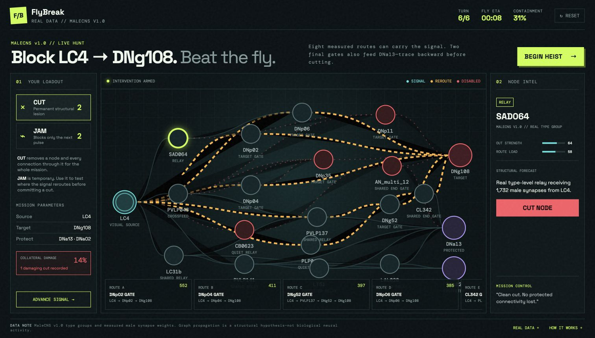
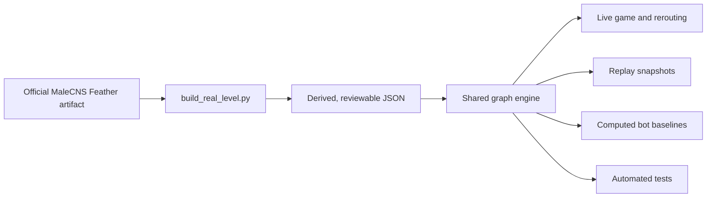

# FlyBreak

> **Save the cake. Spare the fly. Break the circuit.**

[](https://flybreak-neural-heist.shriyasai8.chatgpt.site)

*Watch the intervention unfold, or click the animation to play FlyBreak.*

**CUT pathways. JAM nodes. Protect collateral circuitry. You have 30 seconds. The fly has eight escape routes.**

## One-sentence concept

FlyBreak is a real-time neural-heist game where you race a fruit fly through a graph derived from its connectome, cutting target pathways without destroying protected circuitry.

## How the game works

A visual signal begins at the real MaleCNS cell-type group `LC4` and tries to reach `DNg108`. You have 30 seconds to stop it while keeping structural routes to `DNa13` and `DNa02` alive.

- **Cut** permanently removes a node and every incident connection.
- **Jam** blocks a node for one signal pulse, letting you test a hypothesis before committing.
- Every four seconds, the fly recomputes the strongest surviving routes and visibly reroutes.
- Cutting a shared node can suppress the target but also reduce protected connectivity, producing a collateral-damage penalty.
- Two tempting end gates, `AN_multi_12` and `CL342`, also feed protected `DNa13`. The surgical play is to trace them backward and disable their quieter ingress relays.
- A detailed replay walks through every intervention, reroute, containment change, and collateral event.

In other words: the fly has eight backup plans, and you have thirty seconds to become a very tiny network engineer.



## Why this is interesting

Most connectome visualizations are designed for inspection. FlyBreak turns structural connectivity into a decision problem: **which intervention blocks the target while preserving the rest of the network?**

That makes redundancy, bottlenecks, shared pathways, rerouting, and unintended effects immediately tangible. The game rewards precise reasoning rather than indiscriminate destruction—the biggest hub is often the worst target.

## Real connectome data

The playable circuit is derived from the **MaleCNS v1.0** adult male *Drosophila melanogaster* connectome.

| Level component | FlyBreak value |
| --- | --- |
| Source population | `LC4` |
| Intervention target | `DNg108` |
| Protected outputs | `DNa13`, `DNa02` |
| Representation | Cross-matched cell-type groups |
| Displayed network | 21 type groups, 43 directed edges |
| Edge weights | Measured male synapse totals, 19–11,597 |
| Source artifact | `mcns_fw_edge_comp.feather` |

The derived, reviewable level is committed at [`data/derived/malecns_lc4_dng108.json`](data/derived/malecns_lc4_dng108.json). It is copied into `dist/` for the browser game.

## Methodology

1. Read the official MaleCNS type-level connectivity table.
2. Select a compact subgraph connecting `LC4` to descending target `DNg108`, plus branches reaching the protected outputs.
3. Keep connections with at least 120 measured male synapses, with four explicitly documented lower-weight edges retained to create two biologically measured shared-gate routes.
4. Represent every connection as a directed, weighted graph edge.
5. Enumerate simple paths from `LC4` to `DNg108`, reject paths containing Cut or currently Jammed nodes, and retain up to eight strongest paths with distinct final gates.
6. Define route capacity as the weakest edge on that route—the graph-theoretic bottleneck.
7. Recompute the surviving routes after every signal pulse. Target suppression becomes containment; damage to protected structural routes reduces precision.

### What “curated” means here

The game does not present every edge in MaleCNS. It uses a deliberately small challenge subgraph so a player can read and manipulate the circuit in 30 seconds. The build script first selects the relevant `LC4` → `DNg108` and protected-output neighborhood, then keeps a fixed, reviewable list of 43 measured directed connections. Four of those connections fall below the general 120-synapse display threshold; they are retained explicitly because they create two real shared-gate routes that make collateral damage possible. No synthetic connections are added.

The exact selected edge pairs, including those four exceptions, live in [`scripts/build_real_level.py`](scripts/build_real_level.py). Every runtime edge is then loaded from the generated JSON—there is no second hand-written graph in the browser code.

### Three layers of numbers

| Layer | Meaning | Examples |
| --- | --- | --- |
| Raw data | Values copied from the official artifact | directed type-group endpoints, male synapse totals |
| Derived graph metrics | Deterministic calculations from the selected subgraph | simple paths, bottleneck capacity, weighted degree, protected reachability |
| Game metrics | Explicit rules layered on the graph | 30-second timer, Cut/Jam effects, containment, precision, collateral penalties |

The finish-screen comparisons are computed from the same graph engine at load time. **Wrecker** cuts the highest weighted-degree eligible nodes, **Navigator** greedily chooses the next cut with the best game score, and **Random** reports a seeded 64-run distribution. These are transparent gameplay policies, not scientific models or prewritten scores.

The preprocessing is reproducible with [`scripts/build_real_level.py`](scripts/build_real_level.py) after placing the official source artifact at `data/source/mcns_fw_edge_comp.feather`:

```bash
python scripts/build_real_level.py
```

## Scientific limitations

FlyBreak is a **structural graph game**, not a biophysical simulation.

- A synapse count is used as a gameplay edge weight; it is not equivalent to physiological efficacy.
- The model does not simulate membrane voltage, spike timing, neurotransmitters, inhibition versus excitation, neuromodulation, plasticity, or sensory feedback.
- Cell-type groups aggregate multiple neurons and therefore omit neuron-to-neuron variation.
- Structural reachability does not demonstrate that a signal propagates along a route in a living fly.
- Cutting a graph node is an intervention metaphor, not a validated prediction of lesion behavior.
- `LC4`, `DNg108`, `DNa13`, and `DNa02` are used as gameplay source, target, and protected populations; the game does not claim that this circuit alone explains cake-seeking or any specific behavior.

The animated courier flies show the graph algorithm moving through available paths. They do **not** depict measured neural activity.

## Architecture



`dist/graph-engine.js` is the single rules engine used by the live game, replay, baselines, and Node test suite. The interface contributes presentation metadata—positions, labels, and dialogue—but not a duplicate edge list.

## Run locally

Requirements: a recent version of Node.js and npm.

```bash
git clone https://github.com/Shriya-sai/FlyBreak.git
cd FlyBreak
npm run dev
```

Open [http://127.0.0.1:4173](http://127.0.0.1:4173).

No API keys or backend services are required.

Run the graph-engine test suite with:

```bash
npm test
```

## Project attribution

Built for **Fruit Fly-athon 2026** by Shriya Sai. FlyBreak’s source code and original assets are released under the [MIT License](LICENSE); the underlying MaleCNS dataset retains its separate CC BY terms described below.

## Data attribution

FlyBreak uses data released with **MaleCNS v1.0** by the Fly Connectome project. The dataset is provided under **CC BY**, so downstream reuse should retain attribution to the original dataset and authors.

- [MaleCNS v1.0 download portal](https://male-cns.janelia.org/download/)
- [Official `flyconnectome/2025malecns` repository](https://github.com/flyconnectome/2025malecns)
- Source table used by this project: `supplemental_data/mcns_fw_edge_comp.feather`

FlyBreak's circuit selection, game mechanics, interface, and explanatory text are project-level additions built on top of that attributed dataset.

### Citation

If you use the game or its derived level, please cite both this repository and the underlying MaleCNS release:

```text
Sai, Shriya (2026). FlyBreak: a real-time structural-intervention game
built from the MaleCNS v1.0 fruit-fly connectome.
https://github.com/Shriya-sai/FlyBreak

Fly Connectome Project. MaleCNS v1.0 adult male Drosophila connectome.
https://male-cns.janelia.org/download/
```
